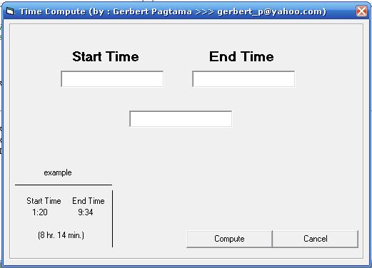



## Time Computation

### Description

a simple demonstration for time computation
 
### More Info
 

             |
---                |---
**Submitted On**   |2007-05-29 21:02:26
**By**             |[Gerbert Pagtama](https://github.com/Planet-Source-Code/PSCIndex/blob/master/ByAuthor/gerbert-pagtama.md)
**Level**          |Intermediate
**User Rating**    |4.2 (21 globes from 5 users)
**Compatibility**  |VB 3\.0, VB 4\.0 \(16\-bit\), VB 4\.0 \(32\-bit\), VB 5\.0, VB 6\.0
**Category**       |[String Manipulation](https://github.com/Planet-Source-Code/PSCIndex/blob/master/ByCategory/string-manipulation__1-5.md)
**World**          |[Visual Basic](https://github.com/Planet-Source-Code/PSCIndex/blob/master/ByWorld/visual-basic.md)
**Archive File**   |[Time\_Compu2068065292007\.zip](https://github.com/Planet-Source-Code/gerbert-pagtama-time-computation__1-68700/archive/master.zip)

